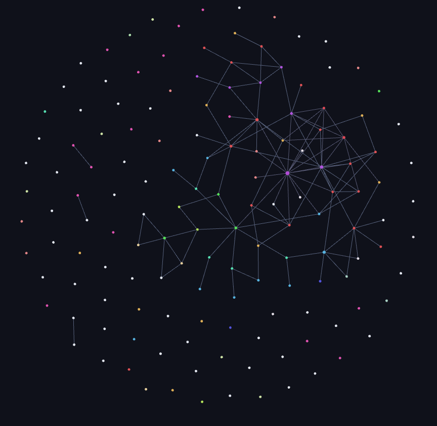
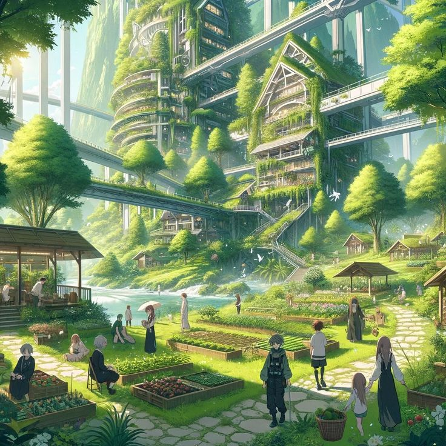
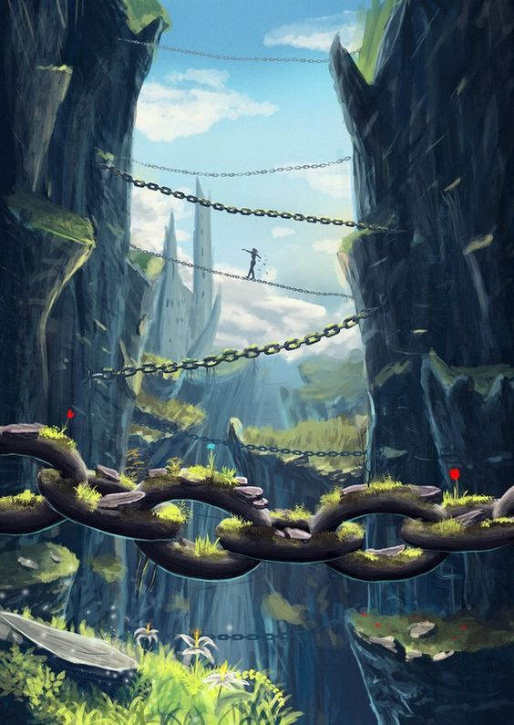

## Qu'est-ce que c'est ?

**Reset** est mon tout premier projet d'écriture. Petit à petit, j'y construis un univers complet : personnages, mythes, légendes et une histoire qui explore la relation entre l'humanité et la technologie.  
L'idée ? Créer un monde riche et cohérent, qui servira aussi de socle pour d'éventuels projets futurs (comme un jeu vidéo, par exemple).

---

## Pourquoi je fais ça ?

J'adore inventer des mondes et donner vie à des idées.  
Quand je crée un jeu, j'imagine toujours l'histoire d'un personnage : pourquoi il fait ce qu'il fait, quelle personnalité il a, etc.
Quand je crée un outil web, je pense à des outils complémentaires et à une grande structure complexe pour l'améliorer.
Cette fois-ci, je m'aventure dans l'écriture pour imaginer un univers où chaque détail compte, du plus petit objet aux grands événements historiques.  
Et si un événement du passé avait changé ? Voilà ce qui me fascine !

Créer une histoire me donne un sujet à développer. Par exemple, si je veux créer un jeu vidéo, je peux situer mon jeu à un moment et à un endroit précis dans mon univers, et j'ai déjà des personnages, des objets, des décors, etc.

---

:::important[Synopsis]

### Le Monde d'Avant

Dans un futur proche, l'humanité vit dans une société ultra-technologique, dépendante des machines et de l'intelligence artificielle.

### Le Reset

Une guerre dévastatrice éclate entre deux visions opposées :
- **Liberté par la technologie** : Ceux qui voient dans l'innovation une source d'émancipation.
- **Retour à l'essentiel** : Ceux qui estiment que la technologie aliène et limite la vraie liberté.

Cette guerre, plus tard appelée "le Reset", dure une décénie et ravage la planète. Les technologies, trop puissantes, détruisent des villes entières et déciment une grande partie de la population mondiale.

### L'Après-Reset

Après la guerre, la nature reprend ses droits sur les ruines de l'ancienne civilisation.  
Un nouvel écosystème émerge, et l'humanité survit dans des communautés qui tentent de préserver les savoirs du passé tout en s'adaptant à leur environnement post-apocalyptique.  
Le tout dans une ambiance **Solarpunk** : technologie propre, en harmonie avec la nature, mais toujours marquée par les cicatrices du passé.

|  |  |
|:-----------------------:|:-----------------------:|

### Les Protagonistes

L'histoire suit plusieurs personnages, nés à différentes époques : avant, pendant et après le Reset, voire parfois, à toutes ces époques à la fois.

### Les Enjeux de l'Après-Reset

Dans ce monde nouveau, les survivants doivent :
- Retrouver et exploiter des ressources et technologies oubliées.
- Faire face aux conflits entre factions aux idéologies opposées.
- Gérer la menace des reliques technologiques de l'ancienne guerre.
- Reconstruire une société en évitant les erreurs du passé.
- Accepter le retour de la nature sur un monde en mutation.

### Thèmes

L'histoire aborde :
- La relation entre l'humanité et la technologie.
- La mémoire collective et les leçons tirées du passé.
- L'équilibre délicat entre progrès et préservation de la nature.
:::
