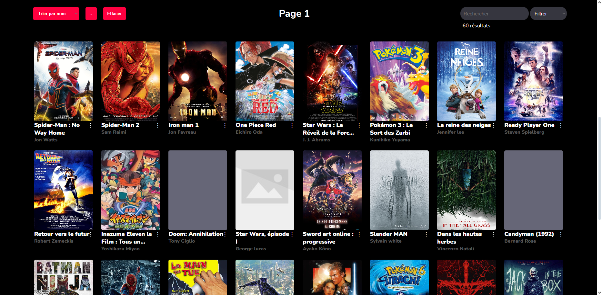

<!-- # Athome -->

## Description

Pour le troisième TP du cours de JavaScript, nous avons expérimenté les API.
L'objectif de ce projet était de faire un "Allo Ciné".
Donc l'idée c'était de créer une plateforme où sont répertoriées des affiches de films, avec des descriptions, des bandes annonces et des likes.
Évidemment, le tout est connecté à une API pour que si l'on veut faire une modification, tout soit mis à jour.

Ce projet était un réel défi pour moi parce qu'il y avait beaucoup de [consignes](#consignes).

## Consignes

L'utilisateur doit pouvoir :

> - Liker/disliker un film 
> - Voir les films aimés 
> - Rechercher un film via le nom du film, de l'auteur ou de la description 
> - Trier les films par date, titre, catégorie, nombre de likes 
> - Filtrer les films par catégorie 
> - Ajouter/supprimer un film 
> - Ajouter/supprimer une catégorie de film 

Le tout doit interagir avec l'API.

S'il n'y a pas d'accès à internet, faire une version "offline" qui permet aux utilisateurs de voir des films dans une quantité limitée.

