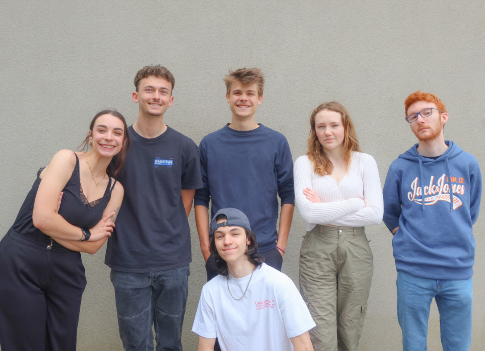
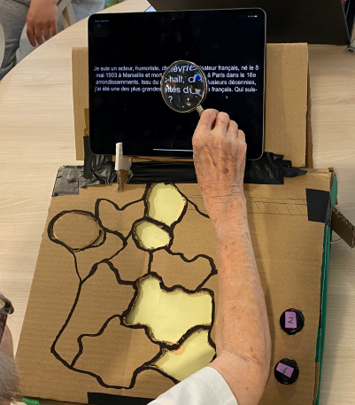
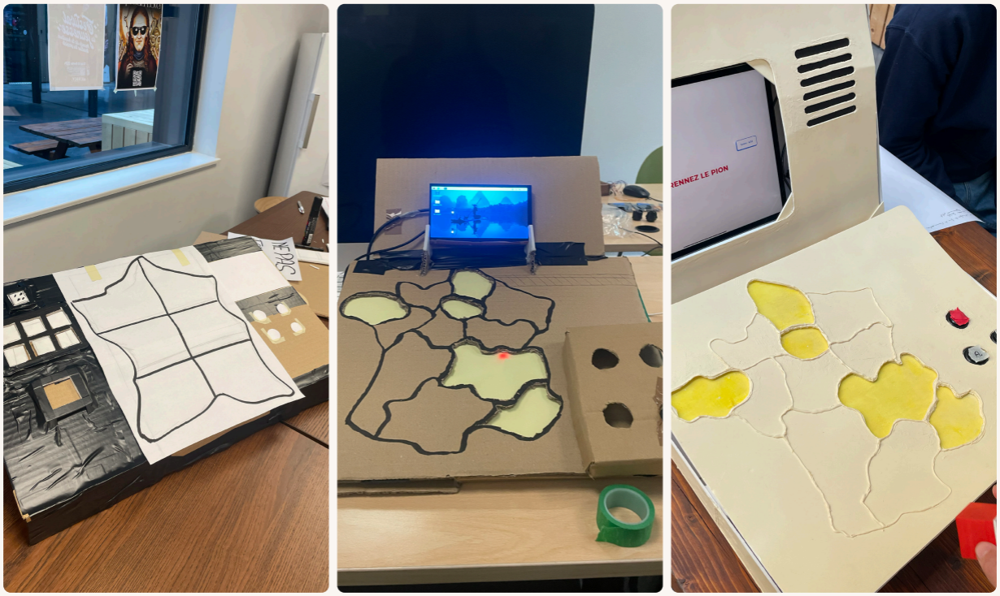
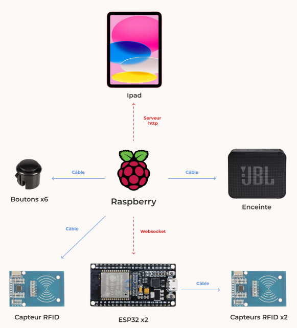
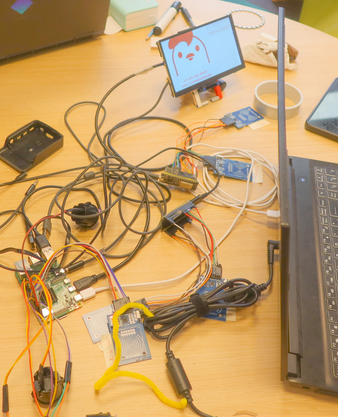

<!-- # Le Bouillon Culte -->

---

:::important[TL;DR]
 

En résumé
 

### Qu'est-ce que c'est ?

"Le Bouillon Culte" est notre projet de fin d'année : un **objet connecté** qui stimule la mémoire des résidents en EHPAD grâce à un jeu de société interactif.  
En collaboration avec [La Fondation du Parmelan](https://fondationduparmelan.org/), nous avons conçu un jeu mêlant questions de culture générale et défis ludiques, intégrant une carte interactive, des boutons, un écran et une enceinte.

:::

---

## Retrouvez le repo GitHub

::github{repo="IlanOu/Le_Bouillon_Culte"}

---

## Notre équipe

- [Elsa FREPPAZ](https://studiomeraki.fr/) (graphiste)
- Jeremy BERTHET (graphiste)
- [Ilan OUTHIER](https://github.com/IlanOu) (développeur) *(moi)*
- [Billie Lou AZZANO](http://www.linkedin.com/in/billie-lou-azzano-066330258) (graphiste)
- [Anthony PELAZ](https://github.com/anthony74742) (développeur)
- Théotime NOBLET (graphiste)

|  |
|:-----------------------:|

---

## L'objectif

En deuxième partie de notre bachelor, nous nous sommes lancés le défi suivant :  
> **Comment faciliter le quotidien des personnes âgées en EHPAD ?**

La réponse : imaginer un **objet connecté** ludique capable de renforcer les liens et de stimuler la mémoire autour de la culture française des années 60 à 80.

---

## Le concept du jeu

Nous avons rencontré [La Fondation du Parmelan](https://fondationduparmelan.org/) et constaté que les résidents adoraient les jeux de société. L'idée était donc de créer un jeu interactif qui les rassemble et les fait réfléchir.

### Les mini-jeux proposés

- **Quelle est cette musique ?**  
  Un blind test pour retrouver la bonne musique.
- **Où c'est ?**  
  Identifier un lieu à partir d'une description.
- **Devine la suite**  
  Compléter les paroles d'une chanson.
- **Qui suis-je ?**  
  Deviner un personnage historique à partir d'indices.
- **Culture générale**  
  Des questions classiques sur divers sujets.
- **Trois images**  
  Relier trois images pour deviner un lieu ou une recette.

### L'objet en lui-même

- **Partie gauche :** Une carte de France pour positionner le pion.
- **Partie droite :** Un bouton rouge pour tourner la roue et quatre boutons pour répondre.
- **Deuxième partie :** Un écran pour afficher les questions et une enceinte pour la lecture audio.

|  |  |
|:-----------------------:|:-----------------------:|
| **Photo de l'objet** | **Modèle 3D de l'objet** |

Le déroulement est simple :

1. **Choix du nombre de questions.**
2. **Tour de roue** pour sélectionner un mode de jeu.
3. **Sélection de la région** sur la carte.
4. **Affichage de la question** et saisie de la réponse via les boutons.
5. **Vérification** de la réponse et attribution d’un point.
6. **Répétition** jusqu’à la fin de la partie, suivie de l'affichage du score final.

<iframe src="https://www.youtube.com/embed/lY2ekTzoxIg?si=z9Esf8ow9zbRBDUV" width="600" height="350"></iframe>

---

## Le parcours des développeurs

### Tests

Tout au long du projet, nous avons pu tester notre objet auprès des résidents de l'EHPAD.  
Ces tests nous ont permis d'identifier et de corriger divers soucis d'utilisation.

|  |
|:-----------------------:|
| **Tests utilisateurs** |

Nous avons réalisé de multiples versions de l'objet pour parvenir à notre rendu final.

|  |
|:-----------------------:|
| **Évolution de l'objet** |

### Développement

Pour éviter de surcharger le Raspberry Pi avec les capteurs RFID et les boutons, nous avons ajouté un **ESP32** pour gérer certaines tâches.

|  |  |
|:-----------------------:|:-----------------------:|
| **Architecture matérielle du système** | **Composants de l'objet** |

Quelques points clés du développement :

- **Connexion des capteurs et des boutons :**  
  Le Raspberry Pi et l'ESP32 fonctionnent en parfaite harmonie.
- **Affichage et audio :**  
  Un écran web et une enceinte offrent une expérience immersive.
- **Gestion des questions :**  
  Lecture de fichiers JSON pour alimenter les 6 mini-jeux.
- **Challenge supplémentaire :**  
  Un système de points et un nombre défini de questions pour encourager les joueurs à rejouer.

> **Petit clin d'œil :** Un grand merci à Théotime pour sa patience et son aide sur les 60 questions !

---

## Pour conclure

Même si le rendu final de l'objet n'est qu'un prototype (le temps et les moyens disponibles nous ont contraints), nous sommes extrêmement fiers du résultat.  
Ce projet m'a permis de plonger dans la programmation orientée objet et de mieux comprendre ce concept, tout en m'amusant !
