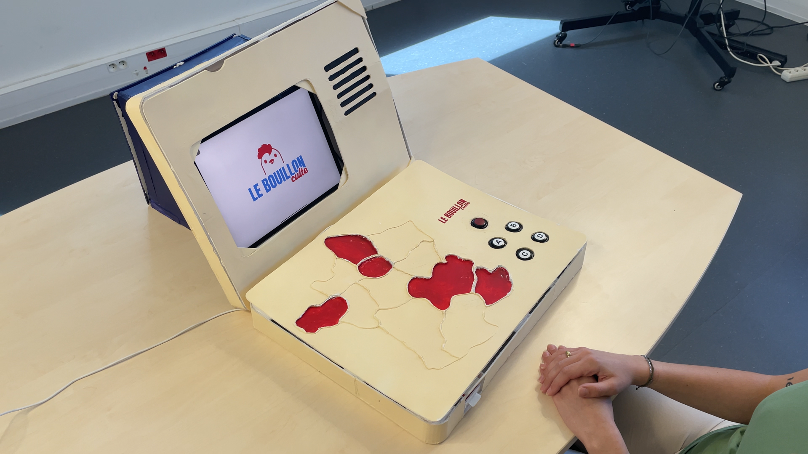

<!-- # Le Bouillon Culte -->

---

:::note[TL;DR]
 

 Pour résumer 
 

### Description

"Le Bouillon Culte", notre projet de fin d'année, est un objet connecté conçu pour faciliter le quotidien des personnes âgées en EHPAD. En collaborant avec [La Fondation du Parmelan](https://fondationduparmelan.org/), nous avons créé un jeu de société qui renforce les liens entre les résidents et stimule leur mémoire.

Le jeu pose des questions de culture générale sous différentes formes et se présente avec une carte de France interactive, des boutons de réponse et un écran avec une enceinte.

### Parcours (du côté du développement)

Nous avons opté pour l'utilisation d'un Raspberry Pi et d'un ESP32 pour gérer les capteurs RFID et les boutons. Après avoir réussi à recevoir les données des capteurs, nous avons développé le système d'affichage et la lecture audio.

Ensuite, nous avons créé un système pour afficher les questions et les réponses à partir de fichiers Json. Nous avons également développé 6 mini-jeux différents.

Pour encourager les joueurs à rejouer, nous avons mis en place un système de points et un nombre de questions à répondre pour finir une partie.

### Conclusion

Bien que nous aurions aimé avoir un meilleur rendu de l'objet, nous sommes fiers du prototype que nous avons créé. Ce projet m'a personnellement permis d'apprendre la POO et de clarifier ce concept.

:::

---

## Liens

Retrouvez le repo Github :

::github{repo="IlanOu/Le_Bouillon_Culte"}

## Équipe

- [Elsa FREPPAZ](https://studiomeraki.fr/) (graphiste)
- Jeremy BERTHET (graphiste)
- [Billie Lou AZZANO](http://www.linkedin.com/in/billie-lou-azzano-066330258) (graphiste)
- Théotime NOBLET (graphiste)
- [Anthony PELAZ](https://github.com/anthony74742) (Développeur)
- [Ilan OUTHIER](https://github.com/IlanOu) (Développeur)(Moi)

## Description

Durant la deuxième partie de notre deuxième année de bachelor, nous avons travaillé sur "Le Bouillon Culte", notre projet de fin d'année.
 
La demande était la suivante :
> Comment faciliter le quotidien des personnes âgées en EHPAD ?

Et l'objectif était de concevoir un **objet connecté** !

Pour répondre à cette demande, nous sommes allés voir [La Fondation du Parmelan](https://fondationduparmelan.org/) qui est l'EHPAD avec qui nous avons travaillé tout au long de notre projet.

Durant nos entretiens avec les personnes âgées, nous avons pu remarquer qu'elles passaient du temps à jouer aux jeux de société ou aux cartes.
 
Nous avons aussi remarqué que plusieurs résidents avaient des troubles de la mémoire, ils oubliaient des choses, d'autres avaient peur que l'EHPAD accueille trop de monde et qu'il n'y aurait plus vraiment de liens entre les résidents.

Alors nous avons réfléchi à un objet pour à la fois lier les résidents entre eux et leur faire travailler la mémoire sur un sujet qu'ils aiment !
 
C'est comme ça qu'est née l'idée du Bouillon Culte !
 
C'est un jeu de société qui demande aux joueurs d'avoir des connaissances sur chaque région de France dans les années 1960 à 1980.

C'est comme ça que nous avons imaginé notre nom ! Pour faire référence à l'émission TV "Bouillon de culture" mais aussi pour exprimer un mélange de connaissances et pour faire un jeu de mots sur "le bouillon cube".

Notre jeu de société pose des questions de culture générale aux joueurs sous différentes formes :

- "Quelle est cette musique ?" -> un blind test : l'objectif est de retrouver la bonne musique qui a été passée.
- "Où c'est ?" : il faut retrouver un lieu à partir d'une description
- "Devine la suite" : Une musique est passée, il faut trouver la suite des paroles
- "Qui suis-je ?" : Avec une description, retrouver le bon personnage historique
- "Culture générale" : Des questions de culture générale
- "Trois images" : quelle recette peut-on faire avec les 3 ingrédients des images ou alors, avec les 3 images, il faut retrouver le bon endroit

Le jeu se présente de la façon suivante :
 
Sur la première partie de l'objet, à gauche, il y a une carte de France avec les régions creusées pour pouvoir placer le pion dessus.
 
À droite, il y a 1 bouton rouge pour faire tourner la roue, et 4 boutons pour répondre aux questions.

Sur la deuxième partie de l'objet, il y a un écran et une enceinte.

Voilà une représentation de l'objet "parfait" qu'on aurait aimé pouvoir faire :

Tout au long du jeu, il y a un présentateur qui accompagne les joueurs.

Le parcours est le suivant :

1. **Choix du nombre de questions :** Le joueur décide combien de questions il veut tenter de répondre.

2. **Tourner la roue :** Avec une simple pression sur le bouton rouge, la roue tourne et le mode de jeu est tiré au sort.

3. **Sélection de la région :** Le joueur choisit la région sur laquelle il souhaite être interrogé.

4. **Affichage de la question :** La question s'affiche à l'écran et le joueur utilise l'un des quatre boutons pour donner sa réponse.

5. **Vérification de la réponse :** La réponse du joueur est vérifiée. Si elle est correcte, un point est accordé ; sinon, il passe à la prochaine question.

6. **Recommencement :** Le processus se répète pour chaque nouvelle question.

À la fin de la partie, une fois que toutes les questions ont été répondues, le joueur découvre son score final. Il peut ensuite recommencer une nouvelle partie pour tenter d'améliorer son score !

<iframe src="https://www.youtube.com/embed/lY2ekTzoxIg?si=z9Esf8ow9zbRBDUV" width=600 height=350/>

.

## Parcours (du côté du développement)

Pour commencer, on a réfléchi aux technologies dont on aurait besoin.
 
On s'est vite aperçu que tous les capteurs RFID et les boutons qu'on voulait utiliser risquaient de surcharger le Raspberry Pi.
Du coup, on a opté pour l'ajout d'ESP32 pour épauler le Raspberry et éviter qu'il ne soit débordé.
 
Après ça, nous avons testé l'ajout de certaines fonctionnalités qu'on voulait intégrer.
 
Par exemple, on a travaillé sur les boutons, les capteurs RFID, etc.
 
Anthony s'est concentré sur les tests avec un ESP32, pendant que je m'occupais des tests sur le Raspberry Pi.

> Mise en place Raspberry Pi : Check ✔  
> Mise en place ESP32 : Check ✔  
> Réception des données des capteurs : Check ✔  

Une fois qu'on a réussi à recevoir les données des capteurs, on s'est attaqués au traitement de ces infos et à la conception du parcours utilisateur.
 
On a alors branché un écran et développé le système d'affichage.
Pour faciliter la partie design plus tard, on a opté pour un affichage sur une page web.
 
On a aussi ajouté une enceinte et fait un système pour lire les fichiers audio.

> Affichage : Check ✔  
> Lecture audio : Check ✔  

Ensuite, il fallait pouvoir afficher les différentes questions et réponses de notre jeu, alors nous avons créé un système qui lit des fichiers Json et les affiche sur l'écran.
 
*(D'ailleurs merci à Théotime qui a énormément aidé pour le remplissage des fichiers Json, il y avait environ 60 questions contenant chacune : des réponses + des descriptions + des images + des audios... Il est très courageux et patient !)*

Nous avons dû faire 6 systèmes car nous avions 6 mini-jeux différents.

> Système de questions/réponses : Check ✔  
> 6 mini-jeux : Check ✔  

Par la suite, en testant et en faisant tester notre objet, nous avons remarqué plusieurs choses :

- L'idée est très cool, elle plaît à beaucoup de gens
- Mais les joueurs ne répondent qu'à une question, ensuite ils s'en vont (surtout les personnes âgées)

Alors on a réfléchi encore une fois, à une façon de donner envie aux joueurs de rejouer.
 
On a donc fait un système de points et un nombre de questions à répondre pour finir une partie, ça permet de challenger les joueurs !

> Donner envie aux joueurs de rejouer : Check ✔  

Et voilà ! C'est en gros notre parcours du côté des devs (au niveau du code) !  
Il y a plusieurs tâches que nous avons faites en plus mais que je n'ai pas expliquées ici pour ne parler que des points clés du développement (comme par exemple un système de mise en veille de l'objet)

## Conclusion

Pour finir, on aurait aimé pouvoir avoir un meilleur rendu de l'objet mais par faute de temps et de moyens nous n'avons pu faire qu'un prototype (ce qui était aussi la demande initiale) mais ous sommes quand même très fier du résultat !

Ce projet m'a personnellement permit d'apprendre la POO, c'est un concept qui était un peu flou au début mais qui maintenant est clair !
