<!-- # Kelna -->

## Liens du projet

Retrouvez le repo Github de Kelna :

::github{repo="IlanOu/Kelna"}

Nous avons également créé un site web dédié au projet : [découvrez-le ici](https://readymag.website/u2730643025/4237179/)

---

## Notre équipe

- Alice MELAN (graphiste)
- Matias LA CORTE (graphiste)
- Ugo MOLLIER-BILLET (graphiste)
- [Raphaël MAKARYAN](https://github.com/raphaelmakaryan) (développeur)
- [Ilan OUTHIER](https://github.com/IlanOu) (développeur) *(moi)*

---

## Objectif du projet

**Kelna** est un jeu vidéo 2D, entièrement réalisé en p5.js (sans aucune librairie externe), qui a constitué notre projet de fin de première année de bachelor.  
Le défi ? Créer un jeu vidéo en 2D avec p5.js, sans l'appui de librairies externes, et en y intégrant **deux modes de vue distincts**.

---

## Développement du jeu

Mon équipe et moi avons donné vie à **Kelna**, un jeu inspiré des grands classiques du genre (pensez Mario Bros) et intégrant de nombreuses fonctionnalités :

- **Mécaniques de base :**  
  - **Gravité et mouvements fluides** pour le personnage.  
    > Gravité : Check ✔
    
  - **Système de collisions** pour éviter de tomber à l'infini.  
    > Collisions : Check ✔

- **Optimisation de la carte :**  
  Face à une carte de grande taille qui consommait beaucoup de ressources, nous avons mis en place un système de **"chunks"**. L'idée est de découper la carte en rectangles et de ne charger que ceux autour du joueur.  
    > Chunks : Check ✔

- **Vie et interactions :**  
  - Ajout de **monstres** et de **PNJ** pour donner de la vie à l'univers du jeu.  
  - Intégration d'un système de **combat (PVE)**, de **gestion des items** et de **troc** entre personnages.  
    > PNJ, Monstres, PVE, Items et Trocs : Check ✔

- **Immersion sonore :**  
  Nous avons sollicité [Pierre-Alain de Garrigues (PADG)](https://fr.wikipedia.org/wiki/Pierre-Alain_de_Garrigues) pour réaliser l'introduction du jeu et enregistrer des voix pour le sound design (par exemple, un "Vous êtes morts" en cas de défaite).  
  Un ajout qui renforce l'expérience immersive de **Kelna** !

- **Aspects visuels :**  
  Pour enrichir l'univers du jeu, nous avons travaillé sur divers éléments graphiques, tels que des **tilesets** et la **map** du jeu.  
  Voici quelques illustrations pour vous donner un aperçu de l'ambiance visuelle :
  
  - **Exemples de tilesets et map :**
    
    | 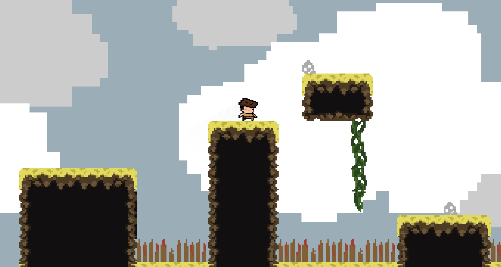 | 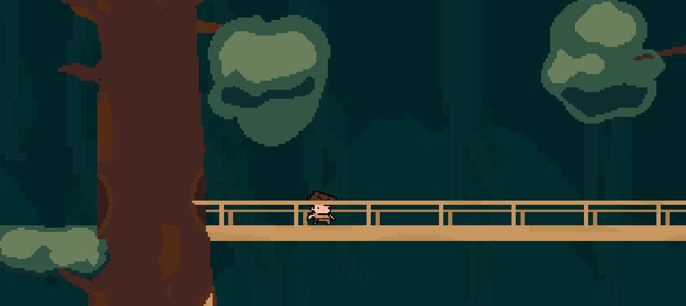
    |:-----------------------:|:-----------------------:|

    | 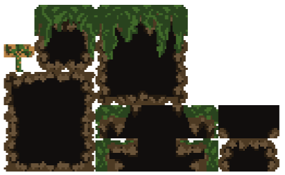 | 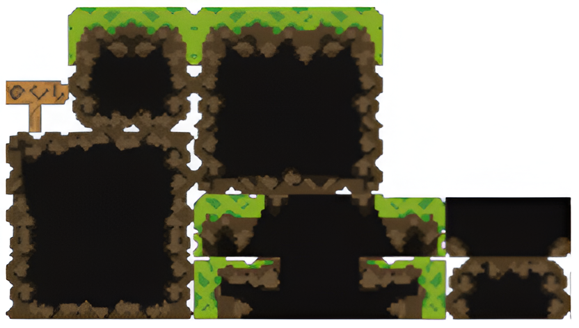 | 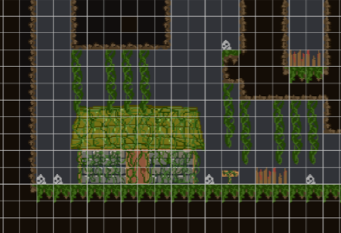 |
    |:-----------------------:|:-----------------------:|:-----------------------:|
  
  - **Système de parallaxe :**
    Nous avons développé un système simple de parallaxe permettant de rendre le rendu plus vivant, plus agréable et plus immersif. Ce n'est qu'un détail mais ça a son importance !

- **Personnages, items et interfaces :**
  Nous avons personnalisé les personnages et les items du jeu. Voici quelques exemples de personnages et d'items :

  - **Personnages :**

    | 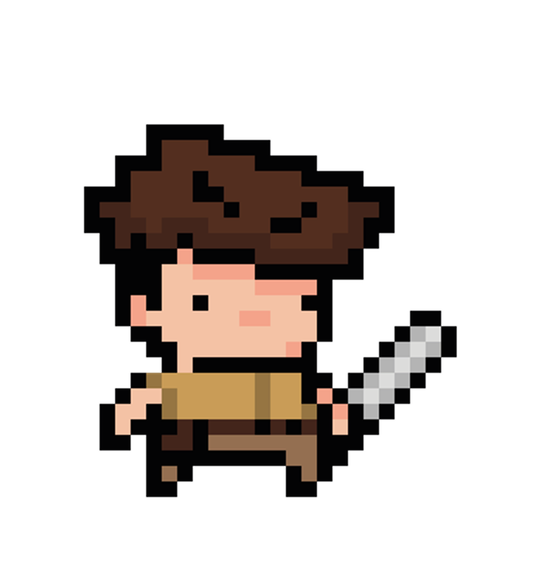 | 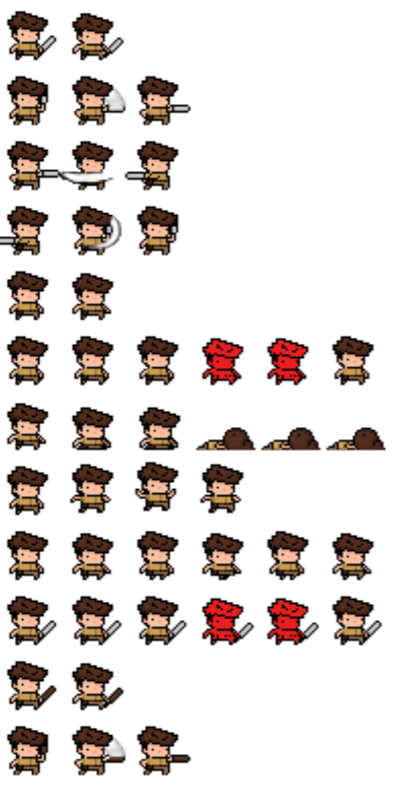 |
    |:-----------------------:|:-----------------------:|
    | Yvo| Animations d'Yvo |
    
    | 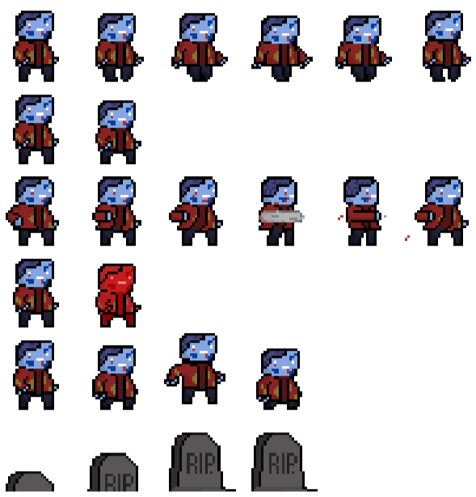 | 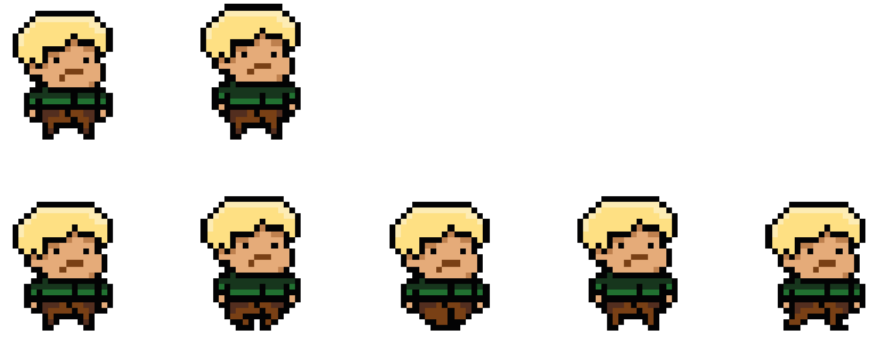 | 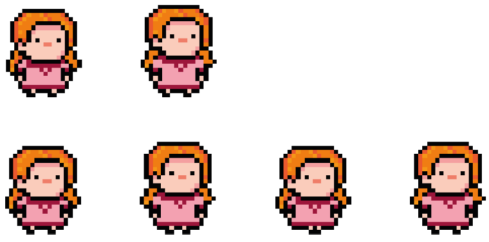 |
    |:-----------------------:|:-----------------------:|:-----------------------:|
    | Animations d'Yvo| PNJ 1 | PNJ 2 |

  - **UI :**

    - **Inventaire :**

    | 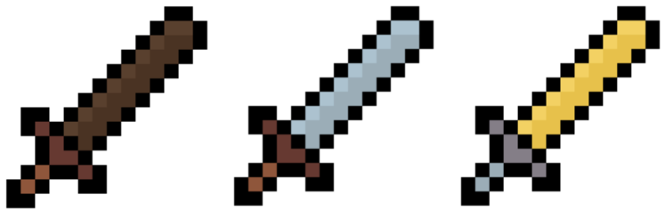 | 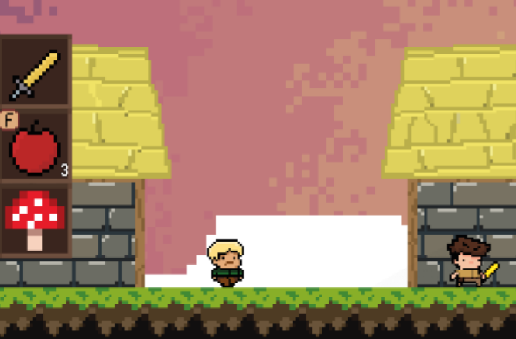 | 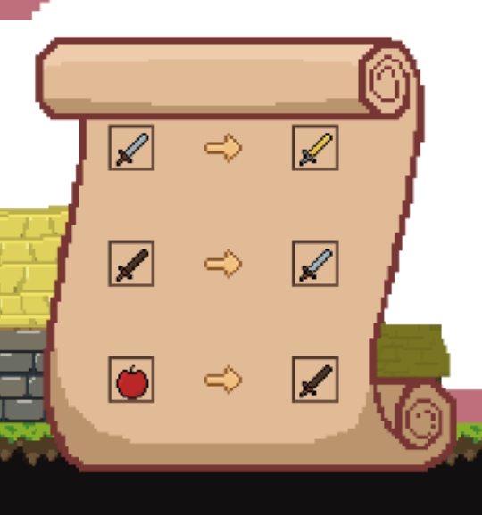 |
    |:-----------------------:|:-----------------------:|:-----------------------:|
    | Différents niveaux d'épées | Inventaire | Système de troc |

    - **Pause :**

    | 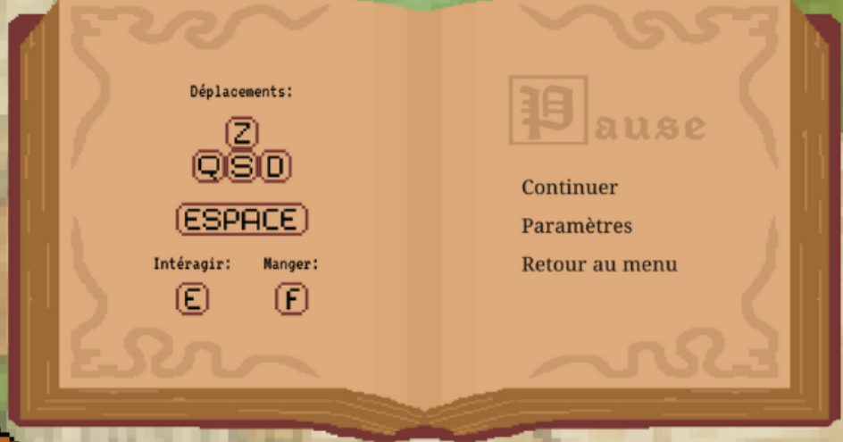 | 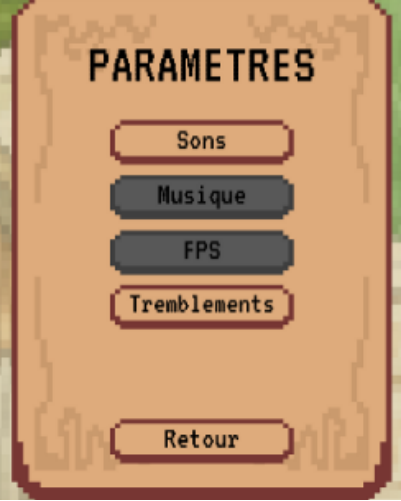 |
    |:-----------------------:|:-----------------------:|
    | Menu Pause du jeu | Menu Paramètres du jeu |

---

## Pitch du jeu

> Dans un monde ravagé par une maladie mortelle, la bien-aimée d’Yvo est mourante. 
> Il se lance à la recherche de la plante légendaire "Kelna", réputée pour guérir tous les maux. 
> Cette plante est gardée par un sorcier fou dans une citadelle à des centaines de kilomètres. 
> Après une aventure semée d'embûches, Yvo parvient à récupérer la plante et un remède est élaboré, mettant fin à l'infection après quelques années.

<iframe src="https://www.youtube.com/embed/lg2jKY5BJls?si=kAcO-KzA2w-I_9aV" width="600" height="350"></iframe>

Et voilà, c'est ainsi que **Kelna** a vu le jour !
