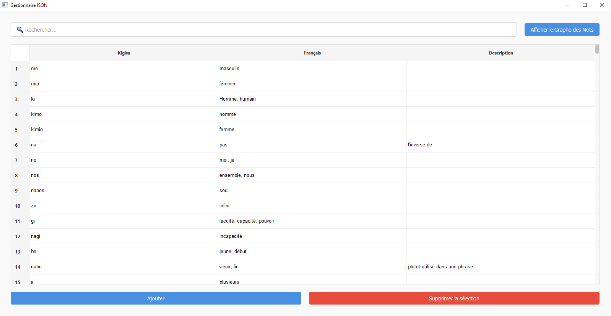

<!-- # Kigisa -->

## Qu'est-ce que c'est ?

**Kigisa** est une langue que j'ai conçue pour être simple et modulable.  
Bien que je doute qu'elle devienne un jour courante, elle offre une flexibilité que je pourrais exploiter dans d'autres projets (comme l'intégrer dans une histoire, par exemple).

---

## Pourquoi ce projet ?  

Le français est une langue incroyablement riche, où une seule idée peut être exprimée de **36 façons différentes**. C'est ce qui fait son charme, mais aussi ce qui le rend parfois un peu… complexe.  

J’ai voulu expérimenter en créant un langage plus direct, où la logique prime sur les exceptions et où s’exprimer devient plus simple et intuitif. Une approche qui change un peu des subtilités du français… **et de ses fameuses règles parfois illogiques** ([cette vidéo l’explique bien](https://www.youtube.com/watch?v=5YO7Vg1ByA8)).  

---

## 1. Introduction
Kigisa est une langue construite conçue pour faciliter la communication.

---

## 2. Éléments de base

### 2.1. Pronoms
Le féminin se forme en ajoutant 'i' au pronom masculin.

| Français    | Kigisa    |
|-------------|-----------|
| Je          | No, Nio   |
| Tu          | To, Tio   |
| Il/Elle     | Lo, Lio   |
| Nous/On     | Nos, Nios |
| Vous        | Tos, Tios |
| Ils/Elles   | Los, Lios |

Exemple simple : `No` → "Je"

### 2.2. Temps verbaux
Utilisation de préfixes :
- `do-` : passé
- `di-` : présent
- `du-` : futur

Exemple avec un pronom : `No di-` → "Je [action au présent]"

### 2.3. Formation des mots
Les mots se construisent avec des racines de plus en plus précises :
- Exemple : `bagosedo` (porc)
  - `ba(gosedo)` = nourriture (cochon)
  - `gose(do)` = animal terrestre (rose)
  - Racines : 
    - `ba` = nourriture
    - `go` = animal
    - `se` = terre
    - `do` = rose

### 2.4. Adjectifs
- Utilisation du suffixe `e`
- Exemple : `kimo e piorio` → "homme rouge"

### 2.5. Structure des phrases de base
Format simple : `[Sujet] [Temps] [Action]`
Exemple : `No di-ba` → "Je mange"

### 2.6. Articles
`ace` s'utilise pour les objets spécifiques (équivalent à "le/la/les" ou "ce/cette/ces")
Exemple : `No di-ba ace bago` → "Je mange cette viande"

### 2.7. Nombres
`kes` est la racine de tous les nombres (un, deux, trois, etc.)
Exemple : `kespa` → "un (1)"

`vo` signifie "zéro" mais pour construire un nombre plus grand (avec plusieurs zéros), on note le nombre de zéros de la façon suivante :
- `kespa-vo` = "dix (10)"
- `kespa-pewo` = "cent (100)"

`wo` est un "multiplicateur" de zéros, avec le nombre de zéros devant le nombre de zéros.

---

## 3. Constructions intermédiaires

### 3.1. Conjonctions
- Virgule (,) pour "et"
- `o` pour "ou"

Exemples simples :
- `No, to` → "Moi et toi"
- `No o to` → "Moi ou toi"

### 3.2. Structure des phrases complète
`[Sujet] [Description] [Interrogatif] [Temps] [Action] [Objet] [Description] [Suffixe]`

Exemple simple utilisant les éléments vus :
`No di-ba ace bago` → "Je mange cette viande"

### 3.3. Localisation
Pour indiquer un lieu : `bu-[lieu]`
Exemple avec les éléments vus : `No di-ba bu-Paris` → "Je mange à Paris"

### 3.4. Questions

#### Questions fermées
Ajout de `ka?` en fin de phrase
Exemple : `No di-ba ka?` (`[Sujet] [Temps] [Action] [Suffixe]`) → "Est-ce que je mange ?"

#### Questions ouvertes
Mots interrogatifs en fin de phrase :
- `kana` : quoi
- `kaki` : qui
- `kabu` : où
- `kazi` : quand
- `kagi` : comment
- `kako` : pourquoi

Exemple simple : `To di-ba kana?` → "Que manges-tu ?"

### 3.5. Possession

#### Marqueur général
Utilisation de `e` suivi du possesseur

#### Pronoms possessifs
| Français  | Kigisa |
|-----------|---------|
| Mon/Ma    | e no   |
| Ton/Ta    | e to   |
| Son/Sa    | e lo   |
| Notre     | e nos  |
| Votre     | e tos  |
| Leur      | e los  |

Exemple simple : `ba e no` → "ma nourriture"

---

## 4. Constructions avancées

### 4.1. Possession multiple
`ba e no, to` → "notre nourriture (à toi et moi)"

### 4.2. Possession en chaîne
`ba e kimo e no` → "la nourriture de mon mari"

### 4.3. Raccourcis linguistiques
- Les racines peuvent avoir plusieurs fonctions (nom/verbe)
- Exemple : `ba` = "nourriture" ou "manger"
- Exemple : `bago` = "viande"
- Fusion possible verbe-nom quand ils se suivent :
  - Au lieu de `di-ba bago` → `di-bago`
  - Note : impossible si le verbe et le nom ne se suivent pas directement

---

## 5. Exemples progressifs
1. Structure simple : `No di-ba` → "Je mange"
2. Ajout d'article : `No do-ba ace bago` → "J'ai mangé cette viande"
3. Ajout de possession : `No di-ba e to` → "Je mange ta nourriture"
4. Question simple : `No di-ba e to ka?` → "Est-ce que je mange ta nourriture ?"
5. Question ouverte : `To di-bago kana?` → "Quelle viande manges-tu ?"

---

## Résultat

Et voilà à quoi ressemble **Kigisa** !

J'ai même développé un graphique pour visualiser les connexions entre les mots.

---

## Et après ?

C'est tout pour le moment !  
J'envisage de créer un traducteur par la suite et / ou, pourquoi pas, d'entraîner un modèle de langage avec **Kigisa**. Ce serait une expérience amusante et pleine de surprises !
