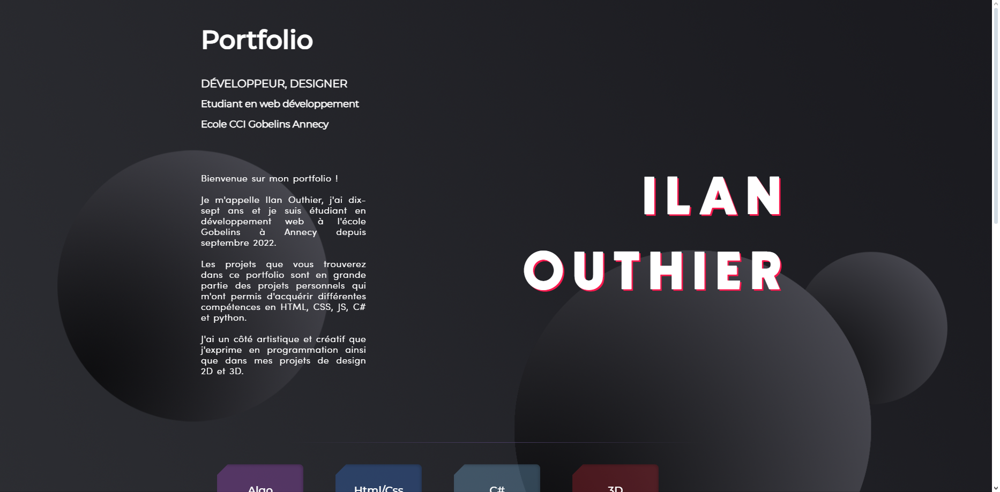
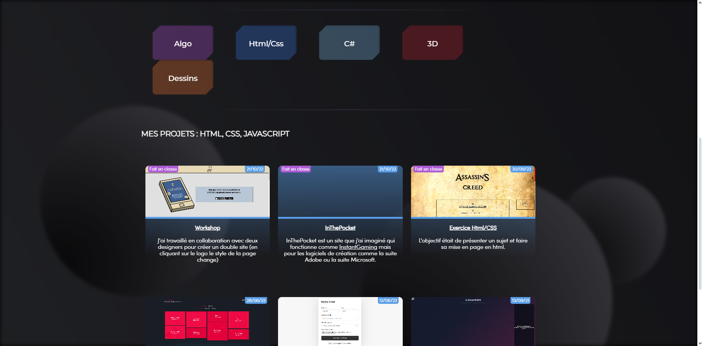
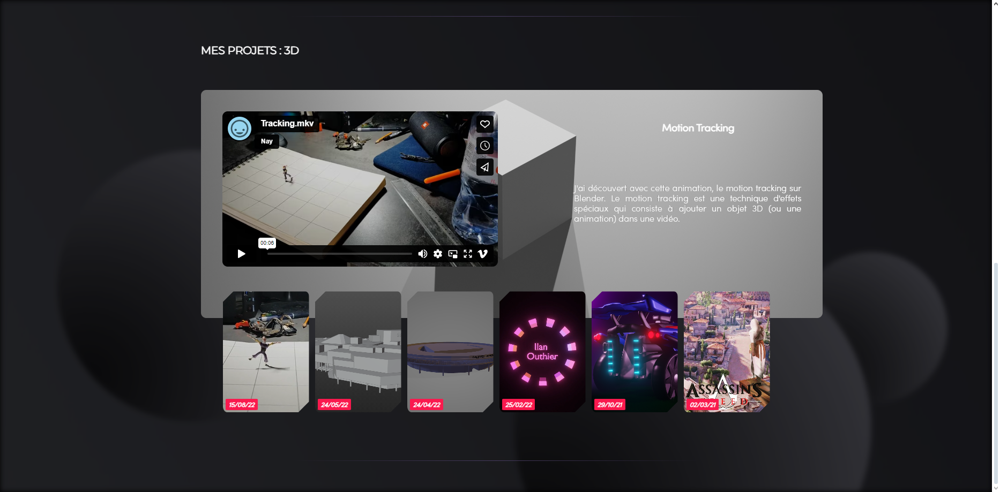

<!-- # Portfolio v1 -->

Après la version initiale de mon portfolio, il était temps de passer à l'étape supérieure. J'ai commencé par travailler dessus chez moi, avec l'idée d'avoir quelque chose de plus épuré et visuellement plus soigné pour présenter mes projets.

Ensuite, lors du deuxième workshop à l'école où nous devions créer un portfolio numérique, j'ai pu reprendre ce projet. J'y ai ajouté des éléments en 3D et corrigé certains problèmes. C'était une belle opportunité de l'améliorer davantage.

Cette version 1 marquait une progression par rapport à mes débuts. C'était un pas de plus vers la maîtrise du développement web, en combinant mes compétences techniques avec un souci du design.

J'avais pu tester des technos que je ne connaissais pas avant d'arriver à l'école, comme ThreeJS qui permet de faire de la 3D en web. J'ai modélisé une carte de visite que j'ai intégré sur mon portfolio. 

Le style était plus technique que celui du précédent portfolio mais c'était aussi le problème car pour intégrer des nouveaux projets, il fallait que je modifie le code...

