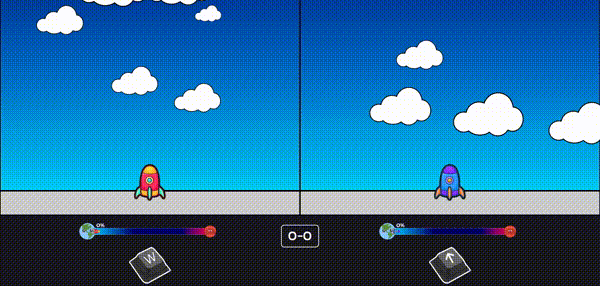

<!-- # Rockets -->

## Description du projet

**Rockets** est un jeu à deux joueurs développé dans le cadre d'un TP en JavaScript.  
Chaque joueur incarne une fusée : l'une bleue, l'autre rouge. Le but est simple : être le premier à atteindre Mars pour remporter la manche !  
À chaque victoire, le joueur gagne des supporters (sous forme de bananes dansantes, évidemment !) et un point.  
Le jeu n'a pas de limite de points, ce qui en fait une aventure infinie.

---

## Les objectifs du TP

Le défi était de créer un jeu pour deux joueurs avec les règles suivantes :

- **Interaction au clavier :** Chaque joueur doit taper sur une touche spécifique.
- **Barre de progression :** Une jauge augmente à mesure que l'on tape.
- **Objectif :** Le premier joueur à atteindre 100 points remporte la manche.
- **Dynamisme :** Si un joueur cesse de taper, sa jauge redescend.
- **Design :** Ajouter du style pour rendre le jeu attractif.

