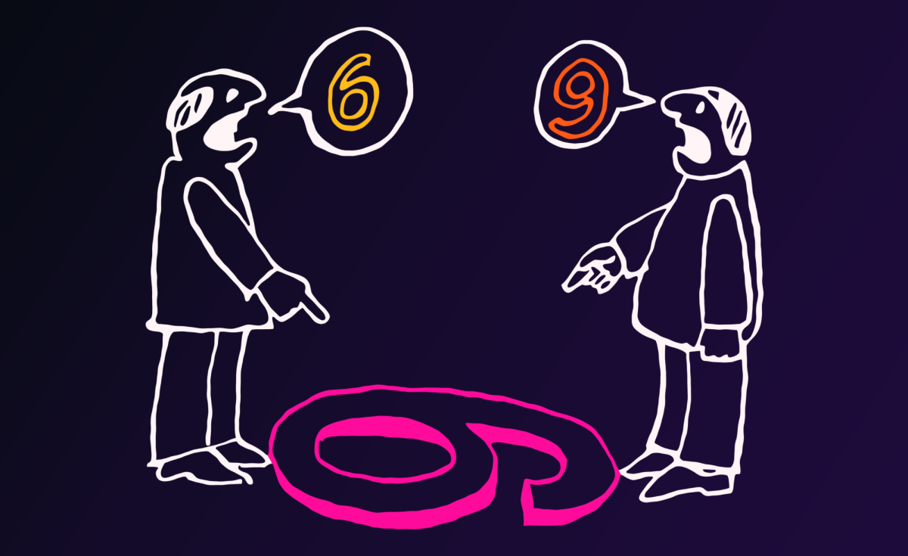
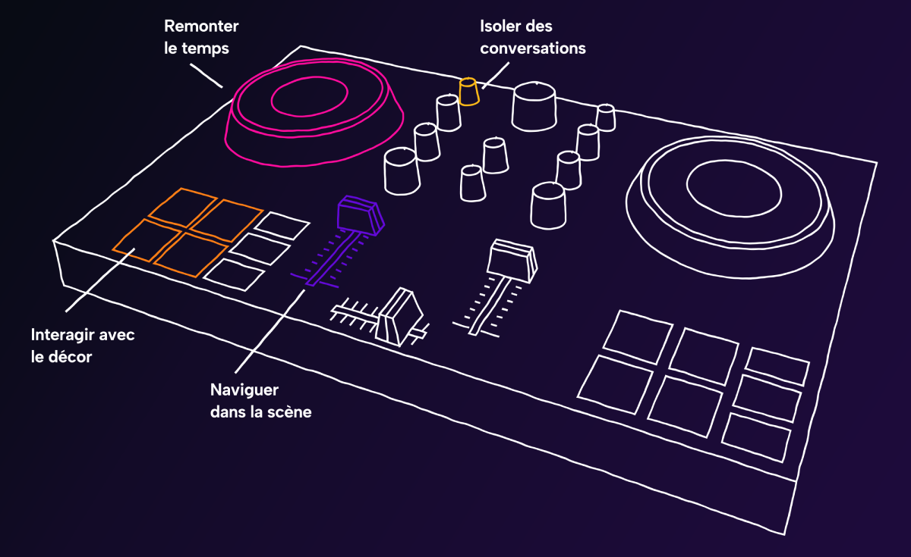
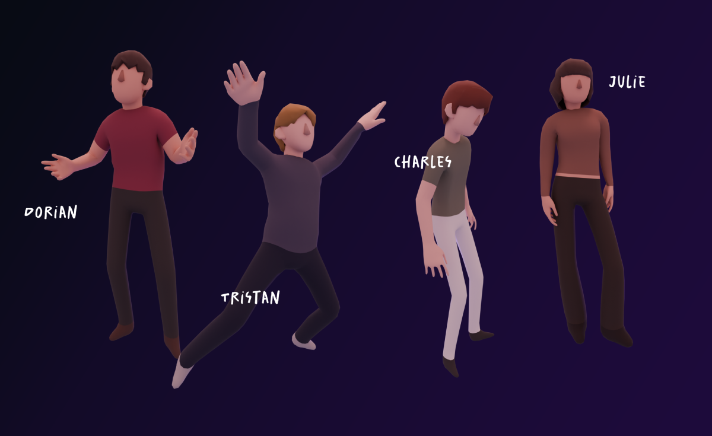
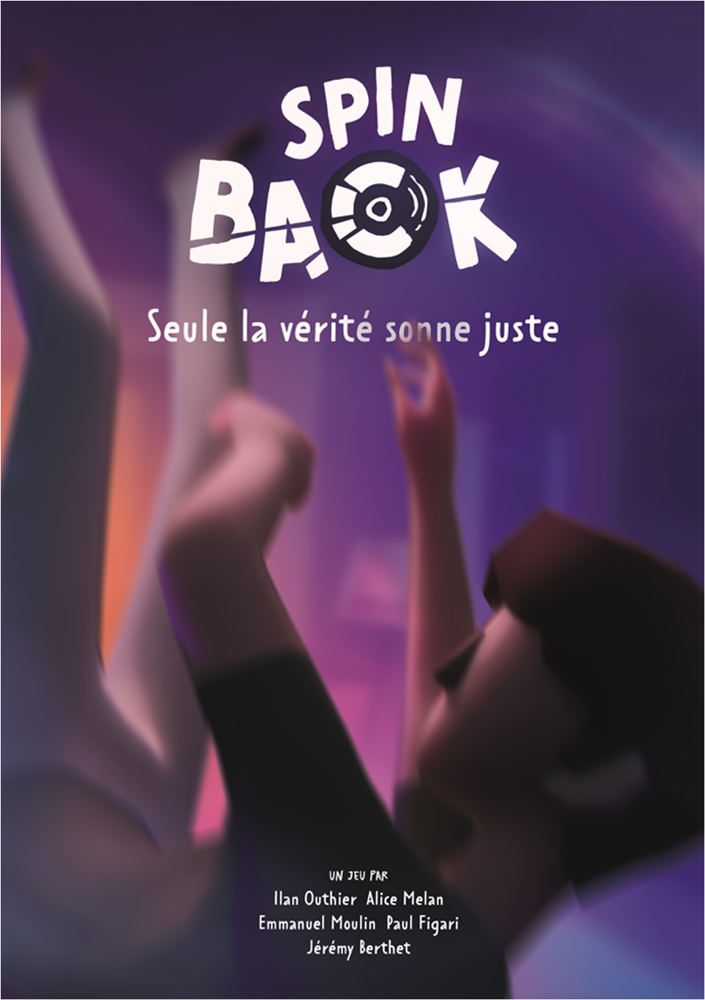

## Retrouvez le repo Github

::github{repo="IlanOu/spinback"}

## Notre équipe

- [Jeremy BERTHET](https://linktr.ee/aarleem) (graphiste)
- Paul FIGARI (graphiste)
- Alice MELAN (graphiste)
- [Emmanuel MOULIN](https://github.com/Kibishi47) (développeur)
- [Ilan OUTHIER](https://github.com/IlanOu) (développeur) *(moi)*

## C'était quoi l'objectif ?

Ce projet de fin de Bachelor 3 avait pour but de **concevoir un projet en équipe** sur le thème **"Fragment(s)"** avec une innovation technique.

Notre problématique : Comment mettre en relation différents points de vue pour faire émerger une seule vérité ?

Et notre envie commune était de créer un jeu avec un moyen d'interaction physique.

## Pitch du jeu

> 🎧 *Spinback* est un jeu d’enquête dans lequel vous incarnez **Fabien**, DJ d'une soirée étudiante qui a dégénéré.
> Un étudiant, Charles, est tombé du balcon... Accident, suicide ou meurtre ?  
> Fabien a tout vu… sans vraiment prêter attention. Interrogé par un policier, il replonge dans ses souvenirs pour tenter de comprendre ce qu’il s’est réellement passé.

> 🔍 Le joueur navigue dans ses souvenirs à l’aide d’une **véritable platine DJ**. En écoutant des discussions, en observant les comportements et en collectant les indices, il reconstitue la vérité.

## Description

Avec [Emmanuel](https://github.com/Kibishi47), nous avons développé ce jeu sur **Unity**, en intégrant la **platine DJ comme contrôleur de navigation temporelle** grâce au plugin **Minis** de [Keijiro Takahashi](https://github.com/keijiro/Minis).
Nous avons aussi développé le focus sonor sur les discussions. Le joueur doit zoomer et modifier la fréquence des dialogues pour les entendre plus clairement.

Les scènes ont été créées avec les **Timelines d’Unity**, permettant de "scrubber" librement le temps à l’aide de la jogwheel de la platine.  
Nous avons animé **4 scènes**, avec plusieurs personnages, effets de lumière, ambiances sonores et dialogues.

Le joueur note ses découvertes dans une **fiche d’enquête interactive**, et son score est calculé selon la **pertinence des indices relevés**. Attention ! Les fausses pistes font perdre des points !

🗣️ Pour renforcer l’immersion, nous avons enregistré **nous-mêmes** tous les dialogues du jeu.
Un grand merci à [Superflame (Geoffrey Petit-Jean-Genat)](https://www.youtube.com/@superflameur), qui a accepté de prêter sa voix au personnage du policier.

Chaque personnage a sa propre personnalité, sa propre voix va donc agir en fonction de son point de vue.
Ce sont des personnalité typiques, mais aussi totalement différentes.

Par exemple, Dorian est populaire et c'est donc lui qui organise la soirée. Il se sent à l'aise pour aller parler aux autres.
Tristan, lui, est réservé et calme, mais il se lâche quand il boit et devient beaucoup plus extraverti.
Charles, lui, n'est pas vraiment là pour faire la fête, il est triste.
Julie est dépassée par la situation : elle doit supporter les trois autres !

## Communication

### Teaser

<iframe 
width="560" 
height="315" 
src="https://www.youtube-nocookie.com/embed/t0MhQf51rM4?si=PiAJdwLnF4oAxQrN" 
title="Spinback Teaser" 
frameborder="0" 
allow="accelerometer; autoplay; clipboard-write; encrypted-media; gyroscope; picture-in-picture; web-share" 
referrerpolicy="strict-origin-when-cross-origin" 
allowfullscreen>
</iframe>

### Affiche

---

> 🕹️ Ce projet fut une expérience collective très forte.  
> Nous avons conçu l’histoire de A à Z, du game design aux dialogues, en passant par les scènes, les mécaniques et les outils.  
> On s’est amusés, on a appris… et on est fiers du résultat.

