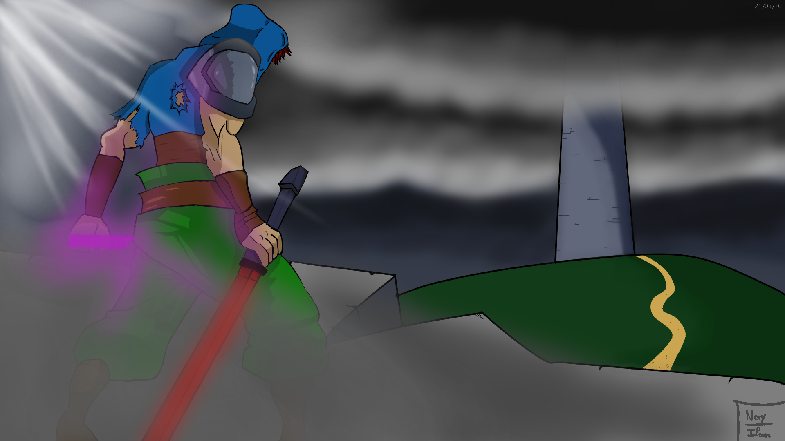
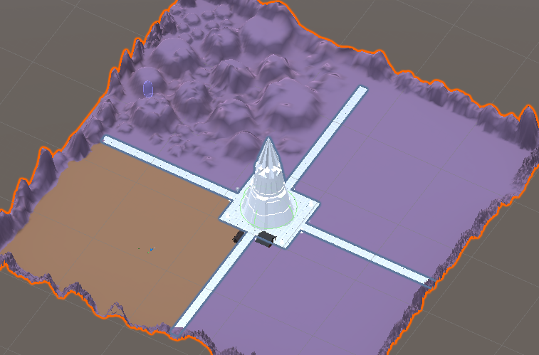
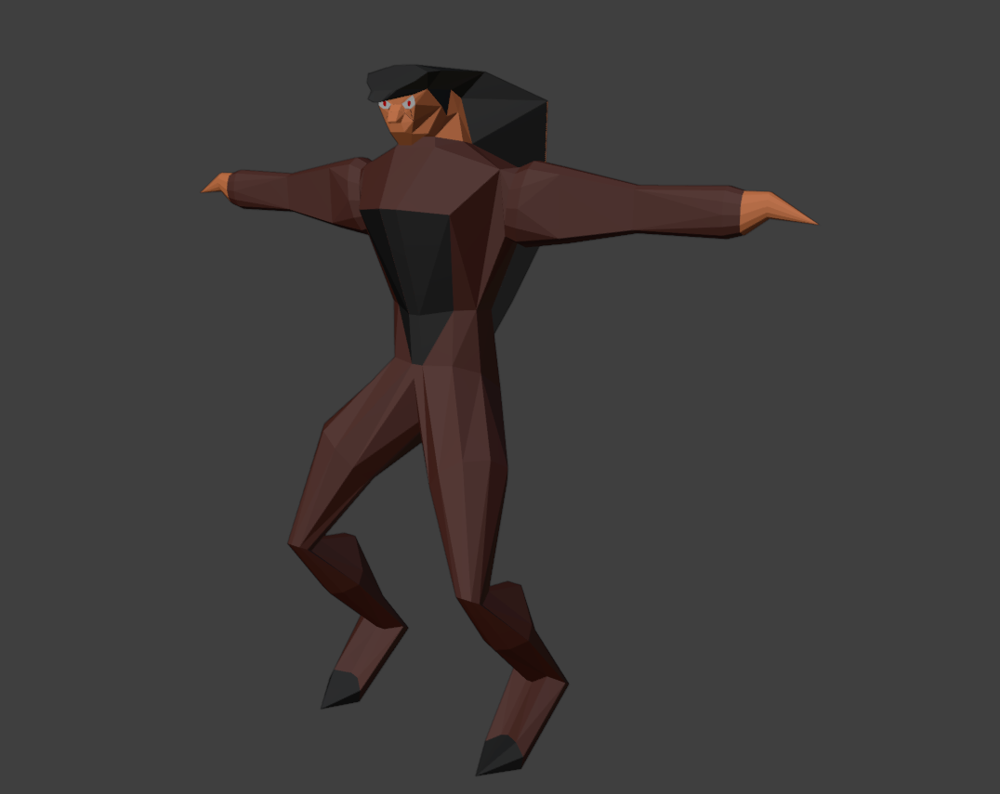

<!-- # The Rook Master -->

## Pourquoi ce projet ?

Ce projet est mon premier projet en équipe avec [Mathieu](https://github.com/math-pixel).
Il créait des jeux sur **Unity** et moi je dessinais pas mal.
Je voulais apprendre à faire de la **3D** alors il m'a proposé de créer un jeu avec lui.
Moi je faisait des modèles, les personnages, les assets, et lui les ajoutais au jeu qu'il développait. C'était génial !
 
Ça m'a permit de me familiariser avec **Blender**, Unity, l'animation 3D, le monde du jeu vidéo, les bases du sound design mais surtout, ça m'a appris à chercher des ressources sur internet.

## Notre idée

L'idée principale vient du même principe que l'anime DanMachi. L'histoire se passe autour de la tour de Babel, récemment terminée, qui renferme des monstres. Plus on monte les étages, plus les monstres deviennent dangereux mais plus les récompenses sont grandes.
 
Notre idée était de créer un jeu vidéo basé sur ce concept, mais avec des personnages provenant d'univers complètement différents ! On voulait inclure des personnages de mangas, de films de super-héros, de romans policiers, et plus encore.
 
On était deux débutants avec de grandes ambitions par rapport à nos capacités... Au moins, on n'avait pas peur !

Voilà une des illustrations que j'ai fais pour le jeu

Mathieu a travaillé sur la carte avec Unity et la construction de terrains. On voit aussi la tour au centre, c'est un modèle 3D que j'ai fais

J'ai aussi fais mon premier personnage sur Blender, puis Mathieu l'a animé et mis dans le jeu. 
 
Ces modèles que j'ai fais ont de nombreux défauts (sans parler visuellement) comme des faces qui ne sont pas réellements reliées entre elles, qu'aucune face n'est triangulé donc on pouvait rapidement se retrouver avec pas mal de bugs graphiques en jeu.

Ce début m'a permit d'avoir une experience dans la modélisation 3D, j'ai appris beaucoup de choses et c'est aussi ce qui m'a permit de me lancer dans l'apprentissage du développement de jeux vidéos et par la suite du Web et Python.
 