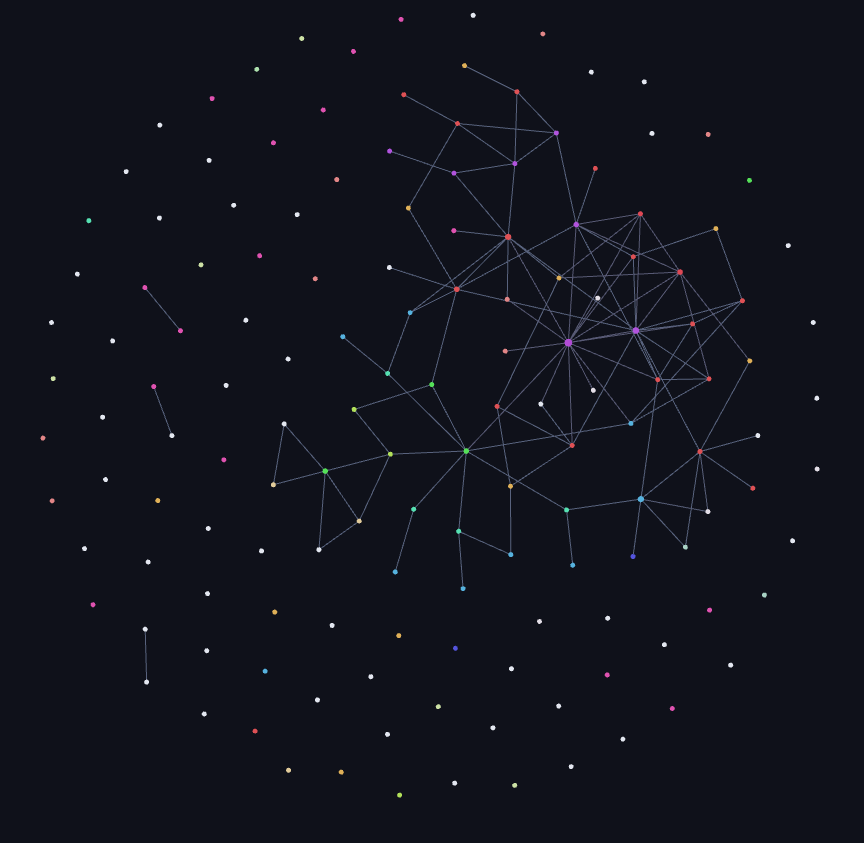
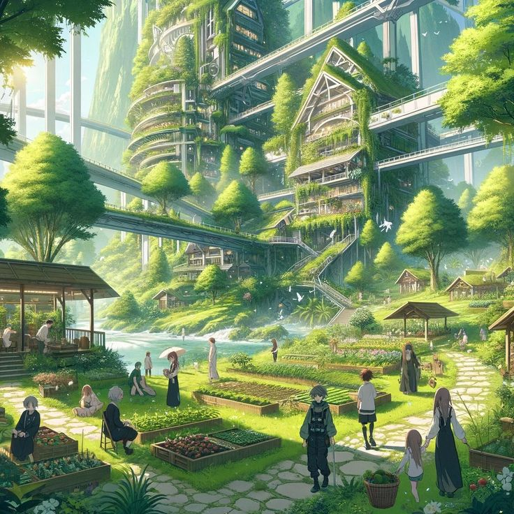
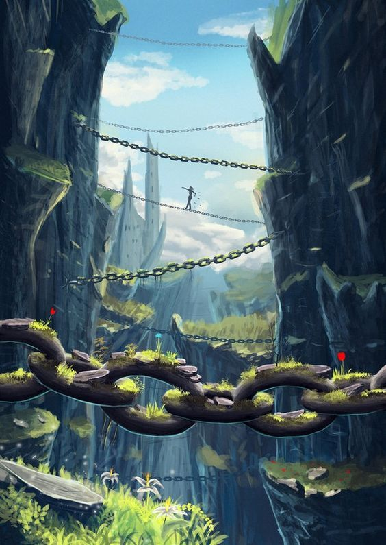

## Qu'est-ce que c'est ?

**Waesiu** est mon projet d'écriture. Petit à petit, j'y construis un univers complet de **science-fiction post-apocalyptique** : personnages, peuples, langues, légendes, technologies et une histoire qui tourne autour d'une seule question : **qui sommes-nous vraiment ?**  
L'idée ? Créer un monde riche et cohérent, qui servira aussi de socle pour d'autres projets (comme un jeu vidéo, par exemple).

:::note
Vous avez peut-être connu ce projet sous le nom de **Reset**. L'univers a bien grandi depuis, et il a changé de nom en chemin !
:::

---

## Pourquoi je fais ça ?

J'adore inventer des mondes et donner vie à des idées.  
Quand je crée un jeu, j'imagine toujours l'histoire d'un personnage : pourquoi il fait ce qu'il fait, quelle personnalité il a, etc.
Quand je crée un outil web, je pense à des outils complémentaires et à une grande structure complexe pour l'améliorer.
Cette fois-ci, je m'aventure dans l'écriture pour imaginer un univers où chaque détail compte, du plus petit objet aux grands événements historiques.  
Et si un événement du passé avait changé ? Voilà ce qui me fascine !

Créer une histoire me donne un sujet à développer. Par exemple, si je veux créer un jeu vidéo, je peux situer mon jeu à un moment et à un endroit précis dans mon univers, et j'ai déjà des personnages, des objets, des décors, etc.

---

:::important[Le pitch]

> **On peut mesurer une âme. Ça ne dit toujours pas qui on est.**

### L'Avant

Une civilisation a découvert que l'âme est une chose **physique** : on peut la mesurer, et même la fabriquer.  
C'est une avancée incroyable, et tout le monde en profite, sans trop se poser de questions...

### La fin de l'Avant

Puis, sans guerre et sans bruit, le monde s'éteint. Une grande partie de l'humanité disparaît en quelques années, et personne n'arrive vraiment à dire pourquoi.  
Cette catastrophe n'a même pas de nom : les survivants parlent seulement de **l'Avant** et de **l'Après**.

### L'Après

Ce qui reste, ce sont des gens qui ne savent plus qui ils sont, dans un monde qui a oublié qu'il avait su.  
La nature reprend ses droits sur les ruines, dans une ambiance **Solarpunk** : une technologie propre, en harmonie avec la nature, mais toujours marquée par les cicatrices du passé.

|  |  |
|:-------------------------:|:-------------------------:|

### Les thèmes

L'histoire aborde :
- L'identité : qui est-on quand on ne sait plus qui on est ?
- La relation entre l'humanité et la technologie.
- La mémoire collective et ce qu'on oublie.
- Le lien avec les autres, et ce qu'il peut coûter.
:::
