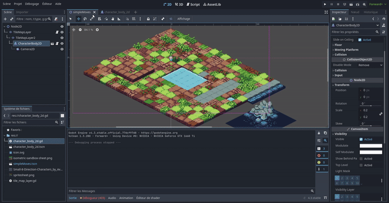
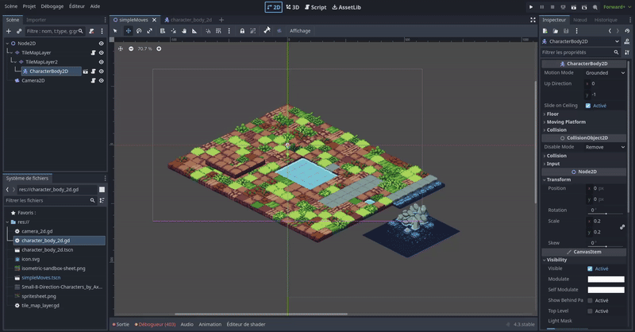
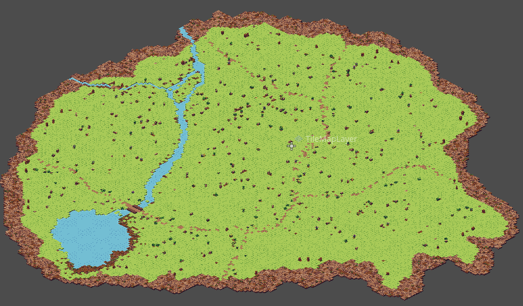
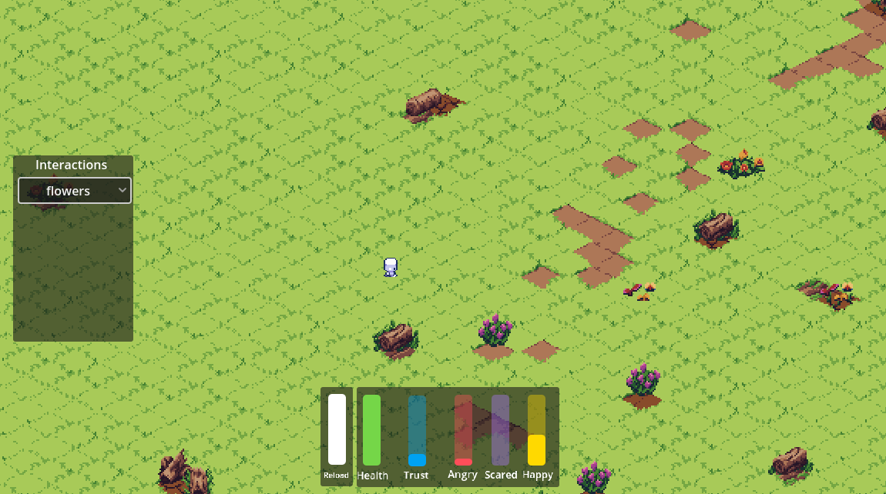

# Qu'est-ce que c'est ?

Je me suis lancé un défi personnel : réaliser ma première game jam en 12 heures. Ce n'était pas un événement officiel, mais un challenge pour enrichir mon portfolio et découvrir Godot, un moteur de jeu que je n'avais encore jamais pris en main.

Pour donner un cadre à ce projet, j’ai sélectionné un thème aléatoire :  
 "Tout est hors de contrôle"

Objectif : créer un jeu fun en un temps limité tout en expérimentant un nouvel outil.  
 J’ai lancé le chrono !

---

## 1ère heure : Brainstorming à fond

Première étape : poser un maximum d’idées autour du thème.

Mots-clés associés : chaos, aléatoire, absurde, peur, panique, glisser, physique incontrôlable, pas de règles...

Mais ça manquait de structure. J’ai donc reformulé la question :  
 ➡️ "Tout est hors de contrôle"... Mais "tout" quoi ?  
 ➡️ "Tout est hors de contrôle"... de quoi ?"  

💡 Idée de gameplay : Dans un jeu, on contrôle un personnage… Et si ce dernier refusait d’obéir ?

Concept : Le but reste d'accomplir une mission, mais le personnage doit être convaincu ou manipulé pour le faire. On peut l’influencer par différents moyens :

- Le guider (lui indiquer un chemin, poser des murs)
- Le pousser à agir (lui faire peur, lui offrir un cadeau)
- Le contraindre (le frapper, créer un piège, invoquer un ennemi)

J’ai défini quelques paramètres influençant son comportement : 

 ✅ Confiance  
 ✅ Émotions (colère, joie, peur)  
 ✅ Santé

En fonction de ces valeurs, le personnage adoptera une attitude différente : 

- S’il a confiance, il nous suivra.
- S’il a peur, il fuira.
- S’il est en colère, il attaquera.

Problème : j’ai l’idée, mais je ne connais pas Godot… Il est temps d’apprendre !

---

## 2ème heure : Premiers pas sur Godot

Apprentissage express ! J’ai suivi quelques tutoriels YouTube pour comprendre l’interface et coder des bases :  
 ✅ Création d’un personnage avec déplacements clavier  
 ✅ Gestion des collisions  
 ✅ Ajout d’une image au personnage  
 ✅ Première map de test en vue isométrique

---

## 3ème heure : Animation et IA du personnage

Graphismes : J’ai trouvé un tileset isométrique sur Itch.io et un sprite animé sur 8 directions.  
Animations : J’ai appris à les gérer dans Godot (très intuitif !).

IA du personnage :

- Idle (ne bouge pas)
- Flee (s’enfuit)
- Chase (attaque)
- Wander (se balade)

J’ai synchronisé ses déplacements avec ses animations et ajouté un suivi caméra.

---

## 4ème heure : Création des jauges de comportement

J’ai implémenté les paramètres internes qui influencent son comportement.  
Les jauges interconnectées :

- Faible santé → augmentation de la peur
- Santé élevée → plus de joie
- Trop de peur → perte de confiance

Le personnage réagit à ses émotions :

- Colère élevée → passe en mode Chase (attaque)
- Peur élevée → passe en mode Flee (fuite)
- Sinon, il se balade ou reste immobile.

---

## 5ème heure : Ajout des interactions du joueur

Le joueur doit influencer le personnage ! J’ai donc listé les actions possibles :  
 ✅ Le frapper → augmente sa colère  
 ✅ Lui offrir des fleurs → augmente sa confiance et sa joie  
 ✅ Faire apparaître un ennemi → augmente sa peur  
 ✅ Faire apparaître un gâteau → baisse sa confiance s'il n'a déjà pas beaucoup de confiance, sinon, augmente sa joie

Le tout impacte directement ses jauges, modifiant ainsi son comportement.

---

## 6ème heure : Améliorations de l’IA

Optimisations :

 ✅ Ajout de l’état Follow (le personnage suit le joueur s’il a confiance et est heureux).  
 ✅ Suppression de la gestion aléatoire des états.  
 ✅ Création d’un menu d’interaction.

Résultat : Le personnage réagit vraiment aux actions du joueur, plus besoin d’éléments aléatoires pour animer l’IA !

Plus que 6 heures...

---

## 7ème → 10ème heure : Expansion du jeu

Progrès majeurs :

 ✅ Nouvelle carte isométrique plus travaillée  
 ✅ Ajout des effets visuels des interactions  
 ✅ Intégration d’un ennemi poursuivant le personnage  
 ✅ Création d’une interface utilisateur (menus, mort, victoire)  
 ✅ Ajout d’un objectif final (une princesse à sauver)

Problème en cours : l’ennemi suit le personnage, mais ne l’attaque pas encore...

---

## 10ème → 12ème heure : Finitions et polissage

Derniers réglages :  
 ✅ Correction de bugs et équilibrage du gameplay  
 ✅ Ajustements de l’IA pour rendre la fuite plus naturelle  
 ✅ Amélioration des interfaces utilisateur  
 ✅ Ajout d’un menu de victoire  
 ✅ Musique de fond ajoutée pour une meilleure immersion !

---

## Bilan : Un défi relevé !

12 heures de travail, un prototype fonctionnel et une belle découverte de Godot.  
 Ce projet m’a permis de :  
 ✅ Apprendre les bases de Godot  
 ✅ Expérimenter une IA (simple) réactive et évolutive  
 ✅ Construire un concept de jeu original et amusant

Prochaine étape ? Peut-être améliorer ce prototype et en faire un vrai jeu jouable !

---

### Vous voulez voir le résultat ?

[Voir sur Itch.io](https://ilanou.itch.io/youre-not-my-boss)